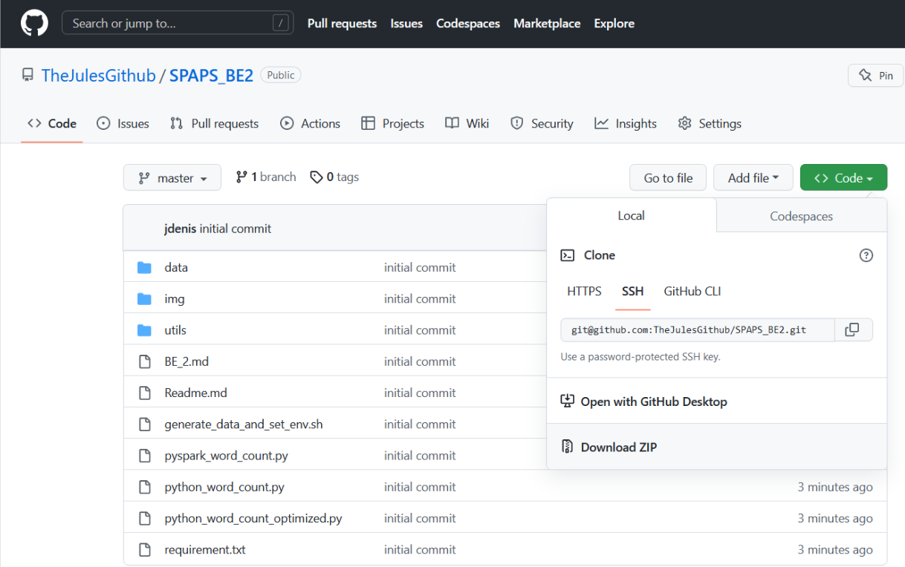
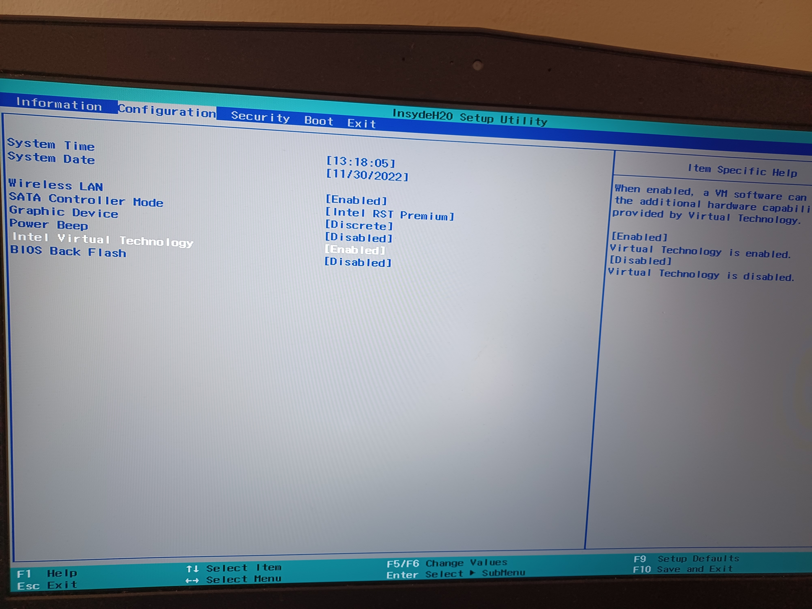
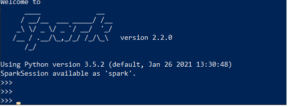
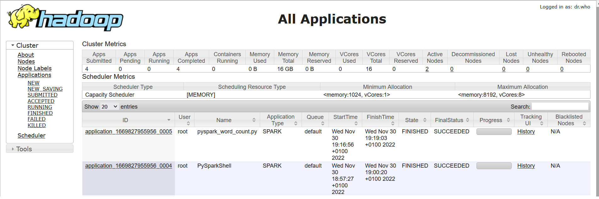
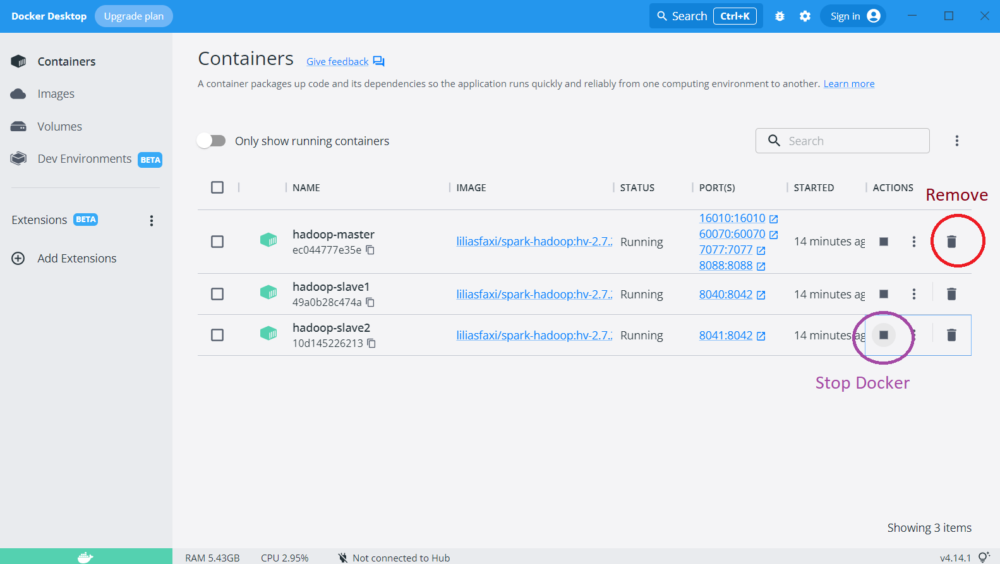
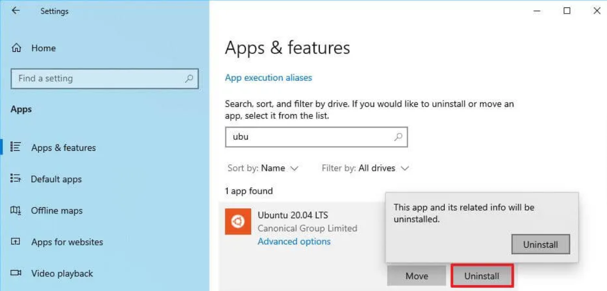

# BE 2

This exercise is directly inspired by [this course](https://insatunisia.github.io/TP-BigData/tp1/) (in french)

Assumption:
* You have administrator right on your machine
* You run a Windows machine

*NB: in this BE, we does not provide any installation tutorial for Mac OS or Linux*

Action performed on this exercise: Install a representative environment to run Spark scripts (local multi-node cluster)
* a) Install WSL: enabling virtual machines / docker
* b) Install docker: permitting to deal with consistant environment 
* c) Install hadoop: permitting to run a minicluster
* d) Configure your cluster
* e) Generate a big dataset
* f) Play with it

## 1/ Exercise 1: installation (~1h)

This exercise focuses on a) b) c) d) and e)

### 1.1/ Retrieve code

Keep prompt open.

1. Go on <https://github.com/TheJulesGithub/SPAPS_BE2> and download package.



2. UnZip it


### 1.2/ Install docker

Docker permits to run reproducible environments with everything installed on it. 

NB: You can find  [here](https://docs.docker.com/engine/install/) installation tutorials for each OS supported by docker 
(CentOS, Ubuntu, Windows, ...)

#### 1.2.1/ Enable `WSL-2`

You need first to install `WSL-2` to enable docker. This tool permits to run linux command (in fact a linux kernel)
on your windows OS.

1. Open a PowerShell command prompt in admin mode:
   * use research bar (`powershell`)
   * right click: `run in administrator mode`
   
   
2. On the PowerShell Command Prompt, type:
```
wsl --install
wsl --update
```

If an help message is display, you may run command:
```
wsl --list --online
```
It permits to check the list of distribution you can run.

Then:
```
wsl --install -d <Distribution>
```
Where `<Distribution>` is a Linux available distribution (e.g. `Ubuntu`).

3. An Ununtu command prompt open, and ask you after some second a username and pwd. Provide pwd and username 
(not necessarily the same than your windows account).

4. Restart your laptop

*NB*: You can find [here](https://learn.microsoft.com/fr-fr/windows/wsl/install) a tutorial for WSL-2 install.

#### 1.2.2/ Install `Docker`

Install Docker Desktop for windows from the [docker website](https://docs.docker.com/desktop/install/windows-install/).

Docker is now running !

#### 1.2.3/ Enable visualisation 

You have to enable visualisation (usage of docker). It is done via the BIOS settings.

1. Restart PC
2. While you are on the 'restart' screen press any of these keys and you enter the bios settings in windows: esc, f1, f2, f3, f4, f8 or delete
3. For intel based systems:
    * press f7 (advanced mode)
    * go to advanced
    * cpa configuration
    * enable visualisation
    
 

#### 1.2.4/ Check installation

1. Open `Docker Desktop` as administrator. 

If something go wrong with Docker Desktop: troubleshoot > Reset to factory defaults and reboot.

If everything is OK, your docker is now installed !


### 1.3/ Install an Hadoop cluster
Hadoop will permit you to run computations in distributed mode (with one master and 2 workers).

1. Download docker image : Open a windows powerShell as administrator and type:
`docker pull liliasfaxi/spark-hadoop:hv-2.7.2`
Wait a moment.

This command permits you to grab an already ready to use docker environment with everything installed on it.

You will now create 3 containers from the image:

2. Create a network permitting to link 3 containers
`docker network create --driver=bridge hadoop`

3. Create and launch 3 containers (`-p` permits to map host port and containers ports)
```bash
docker run -itd --net=hadoop -p 60070:60070 -p 8088:8088 -p 7077:7077 -p 16010:16010 --name hadoop-master --hostname hadoop-master liliasfaxi/spark-hadoop:hv-2.7.2

docker run -itd -p 8040:8042 --net=hadoop --name hadoop-slave1 --hostname hadoop-slave1 liliasfaxi/spark-hadoop:hv-2.7.2

docker run -itd -p 8041:8042 --net=hadoop --name hadoop-slave2 --hostname hadoop-slave2 liliasfaxi/spark-hadoop:hv-2.7.2
```
If not working, try another port.

4. Transfert content of `SPAPS_BE2` on the master-hadoop docker:
 `docker cp SPAPS_BE2/. hadoop-master:/root/SPAPS_BE2/` 

5. Open master container
`docker exec -it hadoop-master bash`

Normally, prompt shall display this text: `root@hadoop-master:~#`, meaning that you are logged on the master docker.
This prompt corresponds a shell CLI of your "hadoop-master" docker. It runs in Ubuntu (Linux).

NB: You can type `exit` (or Ctrl-D) to exit.

6. Launch hadoop and spark:
`./start-hadoop.sh`

*NB:* You can now open a borwser and go to `http://localhost:8088/cluster` to get Hadoop user interface. 

7. You will generate useful dataset with python dedicated scripts:
`source ./SPAPS_BE2/generate_data_and_set_env.sh`

Wait a moment, if everything is Ok, your env is now ready to use !

You can take a break during the installs.

## Exercise 2: word count

In this exercise, we will compare Spark and Python computing time.


### 2.1/ Test word count with regular python script (15 minute wait !)

Go back to your 

1. Display content of script `SPAPS_BE2/python_word_count.py`:
`cat SPAPS_BE2/python_word_count.py` 

You can also display it on github.
It contains a script to count word occurence with pure python code (optimized).

2. Run it (computation shall take a moment - ~15 minutes, you can go to break or make the next section first 
if you don't want to wait):
`python3 SPAPS_BE2/python_word_count.py`

Note the computing time. 

### 2.2/ Use Spark-Shell

1. Enable python 3 for pyspark
```bash
export PYSPARK_PYTHON=python3
export PYSPARK_DRIVER_PYTHON=python3
```

*NB*: These commands fix the error "python no such file or directory"

2. Put file on Hadoop:
* Create an arborescence:
`hadoop fs -mkdir -p /user/root`

* Put file on hadoop: `hadoop fs -put SPAPS_BE2/data/text.txt`

This file will be available on the cluster. When you will  require a file reading, `Pyspark` will search inside hadoop.

3. In the master node command prompt, type:
`pyspark`

You shall obtain something like this: 


Type Ctrl-D to quit the Pyspark command prompt.

*NB:* To restart master node command prompt:
* Run PowerShell as administrator
* If you remove your docker images: 
```bash
docker run -itd --net=hadoop -p 60070:60070 -p 8088:8088 -p 7077:7077 -p 16010:16010 --name hadoop-master --hostname hadoop-master liliasfaxi/spark-hadoop:hv-2.7.2
docker run -itd -p 8040:8042 --net=hadoop --name hadoop-slave1 --hostname hadoop-slave1 liliasfaxi/spark-hadoop:hv-2.7.2
docker run -itd -p 8041:8042 --net=hadoop --name hadoop-slave2 --hostname hadoop-slave2 liliasfaxi/spark-hadoop:hv-2.7.2
```
* `docker exec -it hadoop-master bash`
* `./start-hadoop.sh`


4. Test word count command typing:
```
# Read file
lines=sc.textFile('text.txt')

words = lines.flatMap(lambda line: line.split(' '))

words_with_1 = words.map(lambda word: (word, 1))

word_counts = words_with_1.reduceByKey(lambda count1, count2: count1 + count2)

word_counts.collect()
```

*NB*: Remember that was commands presented in BE1.
*NB2*: Note that in Spark Shell, the `spark_context` is already created and stored into `sc` variable.

Note the computing time.

### 2.3/ Use a Pyspark script

1. Previous pyspark commands can be run in script mode: display content of this script:

`cat SPAPS_BE2/pyspark_word_count.py`

2. Launch it via spark-submit (local mode):
`spark-submit --master local --driver-memory 4g --executor-memory 2g --executor-cores 1 SPAPS_BE2/pyspark_word_count.py`

In this command:
* `master`: corresponds to the master URL (here `local` means 
"Run Spark locally with one worker thread (i.e. no parallelism at all).")
* `driver-memory`: Memory to be used by the Spark driver.
* `executor-memory`: amount of memory to use for the executor process.
* `executor-cores`: Number of CPU cores to use for the executor process.

*NB* A documentation  can be found [here](https://sparkbyexamples.com/spark/spark-submit-command/).

Note the computing time.

3. Finally, launch it in cluster mode:
`spark-submit --master yarn --deploy-mode cluster --driver-memory 4g --executor-memory 2g --executor-cores 1 SPAPS_BE2/pyspark_word_count.py`

It permits to distribute computation between 2 nodes.

3.1 During computation, go on `http://localhost:8088/cluster` on a web browser, it will open an hadoop dashboard.



Once computation done, you can observe 


Note the computing time.

### 2.4/ Bilan

You can see that, when manipulating medium files (~700 Mo):
* Python regular methods are quite long, and need fine optimizations to be run
* Pyspark (local mode) can handle this volumetry
* Pyspark (cluster distributed mode) can this volumetry in a reasonable computing time.

If you have enough time, you can test command from previous BE (can be found here: <https://github.com/TheJulesGithub/binder_pyspark/blob/main/python/BE1_answer.ipynb>)

## 4/ Clean your env

1. Close all the command prompt

2. Go to docker desktop > containers and click stop button for each container



3. Click on the delete button to delete each container.

You can easily uninstall docker and WSL-2. 




